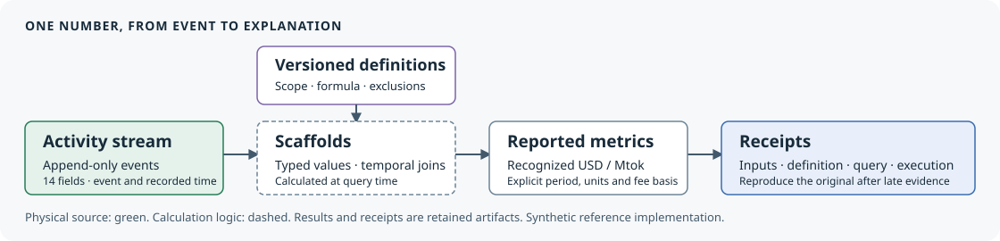

# tokenledger: one activity stream, every reported number reproducible.

**The data model agents actually work on.**

Built from the SOX-controlled subscriber-metrics work I ran at SiriusXM for
19 years. For AI businesses that meter tokens and seats.

[](docs/demo.md)

Recorded at `d83e34f`: 14.45 seconds of process execution plus a declared
40.55-second final reading hold, at original speed. [Capture provenance](docs/assets/audience-recording/recording.json).



The activity stream feeds query-time scaffolds and projections. Versioned
definitions govern reported metrics. Receipts bind each result to its inputs,
definition, query, execution revision and reporting/knowledge cutoffs.

**[Run](docs/run.md)** | **[Understand](docs/understand.md)** | **[Assess](docs/assess.md)**

## One July number, one late invoice, original replay

| July recognized usage | Original knowledge: October 1 | Later knowledge: October 3 |
|---|---:|---:|
| Revenue net of discounts, USD | 30,579.81 | 33,579.81 |
| Revenue net of discounts and fees, USD | 30,543.74 | 33,543.74 |
| Raw tokens, each counted once | 19,210,131,257 | 19,210,131,257 |
| Net of discounts, USD / million tokens | 1.591858462126 | 1.748026057228 |
| Net of discounts and fees, USD / million tokens | 1.589980807074 | 1.746148402176 |

Reporting cutoff: July 31, 2026. Both knowledge cutoffs are in 2026 at 00:00 UTC.
The late invoice adds USD 3,000.00: account **1100 AR debit 3,000.00** and
account **4000 usage revenue credit 3,000.00**. These are the two sides of one
entry, not two revenue changes. Tokens and fees do not change. The original
receipt still reproduces after the append. [Exact values and receipt bindings](docs/assets/demo-summary.json)
and [replay commands](docs/demo.md) retain the proof.

A late invoice changes July's recognized revenue per million tokens. The token
count stays fixed. The accounting bridge explains the change, and the original
receipt still reproduces the earlier number. Run that whole example:

```sh
python -m pip install -e ".[dev]"
tl demo
```

Use Python 3.11.5 from this checkout. The fixture is synthetic, the local engine
is DuckDB, and the demo requires no model, billing or cloud credentials.
[Installation and environment options](docs/run.md).

Reuse the activity envelope, validated writer, snapshots and receipts. Applying
them to another business requires its source contracts, customer identities,
accounting policy and accountable reporting owners. The
[adoption map](docs/adoption.md) shows the integration work and a one-output
migration with reconciliation and rollback.

## How reporting behavior changes

A reader asked the July NRR report for July 1 and got nothing back. That
mistake became a recorded finding, an independent verification, a bounded
diagnostic candidate evaluated against frozen cases, a signed one-run approval,
one next inspection and a recorded outcome. The original report still
reproduces afterwards. Run the whole loop on a fresh synthetic report:

```sh
tl learning walkthrough
```

[Watch the recorded walkthrough and read what each label means](docs/learning.md).
The walkthrough is a credential-free synthetic rehearsal with a disposable
signer. The one actual signed native trial completed **inconclusive** with no
promotion; that honest result is retained, not improved upon.

## What the comparison found

Thirteen output populations matched an independently implemented baseline in
four native BigQuery pairs: one warmup and three measured pairs. Native used
**51.47% fewer billed bytes** and **14.96× median slot time**. It was slower in
the first measured pair. These results belong together.

Warmup is excluded from performance statistics. Accounted wall sums disjoint
intervals, not contiguous latency. List-price arithmetic is not an invoice.
Grok QA is agent-assisted engineering review, not an accounting audit.

[Read the measurement methods, individual pairs and limitations](docs/evidence.md).
The [earlier local tenfold hypothesis failed](docs/evidence.md#the-hypothesis-that-failed):
82 versus 20 relations, with faster baseline builds. That report is preserved.
The large retained populations are an optional, checksum-pinned download;
they are separate from the small demo. Their verification recalculates retained
comparisons and fingerprints without submitting cloud jobs.

## Give it to your agent

Start with [AGENTS.md](AGENTS.md). [Follow the workflow](docs/workflow.md) with a
blank submission, or [verify the visible reference](docs/assess.md#verify-the-reference).
Reproduce July's token yield, explain the late
invoice, change the NRR definition while retaining the old result, and diagnose
the incomplete-source close. Submit the specified evidence to the deterministic
grader and keep failures visible.

This is an **open-book reproduction exercise**. Comparative agent accuracy and
token efficiency remain unmeasured. A reproducible result alone does not prove
source completeness, accounting-policy approval or SOX operating effectiveness.

## Status and limits


Controls demo exits **2**: IAM, audit logs and independent approval evidence
are incomplete. Production IAM and segregation of duties are not established.
L1 is inconclusive, with no promotion and no self-improvement claim. Catalog
4 versus 82 is not a total-complexity reduction. Local DuckDB seconds do not
establish cloud performance. [Candidate gates](release-status.json).

Built by [Chandler Klose](https://github.com/cklose2000).
[Apache-2.0](LICENSE) | [Cite this work](CITATION.cff) | [Release scope](RELEASE.md)
