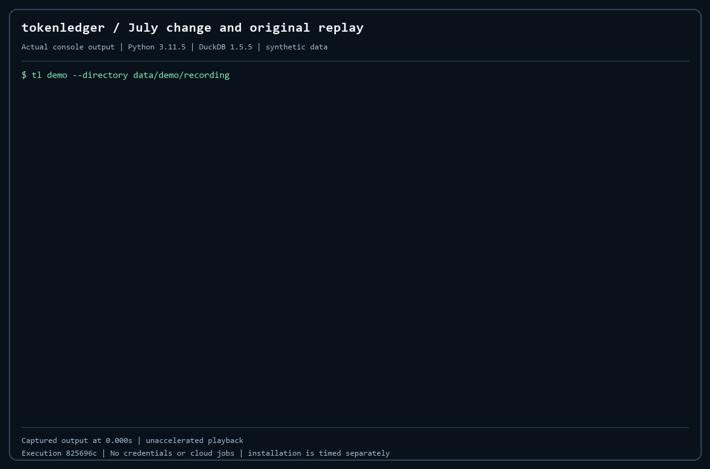

# One invoice changes July. The original result still reproduces.

The table summarizes the retained recorded run before playback. Amounts are net
of discounts and marketplace fees; display precision is rounded only here.

<!-- SUMMARY_START -->
| Measure | Original July | With late evidence | Change |
|---|---:|---:|---:|
| Recognized usage revenue | $30,543.74 | $33,543.74 | +$3,000.00 |
| Raw processed tokens | 19,210,131,257 | 19,210,131,257 | 0 |
| Revenue per million tokens | $1.590 | $1.746 | +$0.156 |

$3,000.00 debit to receivable (1100); $3,000.00 credit to usage revenue (4000).

Derived from yield receipt `mr-6d034188f55d99445ea47b08127c5a74` and account receipt `mr-9df23dbedb0794a5e5c35d9b816f654e`. [Exact values and source bindings](assets/demo-summary.json).
<!-- SUMMARY_END -->



The captured command is `tl demo --directory data/demo/recording`. The fixture
is synthetic. The missing invoice adds **USD 3,000** of recognized revenue;
the denominator stays **19,210,131,257 tokens**. July revenue per million tokens,
net of discounts and marketplace fees, moves from **1.589980807074** to
**1.746148402176 USD/Mtok**. The accounting bridge explains the same change.

This is recorded process output, with its original arrival times. The GIF rounds
timing to centiseconds and holds the final result for six seconds. It does not
accelerate the workflow. For accessible text, use the [complete transcript](assets/recording/demo.txt).
The [interactive local player](demo.html) supports pause and seeking; open the
HTML from your checkout in a browser. GitHub displays HTML source rather than
hosting the player.

## Reproduce the exact recorded number

The release includes this recording's original source and artifacts under
`data/demo/recorded/`. After [installation](run.md), run from the checkout:

```sh
tl --db data/demo/recorded/world.duckdb --artifact-root data/demo/recorded receipt mr-a57e47711e3b91ca3ef32885f5737e63 --json
```

That recalculates the original July population from the retained source, after
the late invoice exists. The yield bridge is
`mr-6d034188f55d99445ea47b08127c5a74`; the balanced account bridge is
`mr-9df23dbedb0794a5e5c35d9b816f654e`. Substitute either ID in the same command
to inspect and re-perform its calculation. The CLI writes new isolated artifacts
when needed; original results remain retained.

To create a fresh example with your own run IDs, use `tl demo`. The specified
recording-directory form is a one-time example; existing evidence is never
overwritten. Historical absolute paths in captured output describe the recording
machine's generic scratch directory. The explicit source and artifact options
above are the relocated replay path.

## Observed environment

The [capture record](assets/recording/recording.json) binds public execution
commit `825696cf31d4c2892078512e612840d791fba2ba`, Python 3.11.5 and the pinned
DuckDB runtime. A fresh Windows virtual environment and editable installation
took **59.623 seconds**, using the existing pip cache. The workflow took
**23.224 seconds**; the process, including startup, took **27.498 seconds**.
Those are this laptop's observations, not a cold-install or hosted-runtime
guarantee. A retained-population verification was running concurrently.

No model, billing or cloud credentials were used. This small demonstration
does not rerun BigQuery or measure agent efficiency. Its deliberately delayed
original July close knows evidence through October 1; the designated missing
invoice arrives October 2. This isolates that invoice from the generator's
ordinary late arrivals.

The [raw timestamped capture](assets/recording/demo.cast) uses the asciicast v2
container for merged stdout/stderr from a pipe, rather than a PTY. The
[render record](assets/recording/render.json) pins the capture, transcript and
derived images. Workflow observation:
`mr-e152a368dd26fe7ef6459e10db26be6e`.

The same late-evidence pattern applies to a decision model. `tl demo-jev`
meters a Jev/OpenRouter call, then a later invoice at a hiked list price.
Tokens do not change. The original receipt still reproduces. See
[Jev token economics](demo-jev-spend.md).

Next: [follow the number through the model](understand.md) or
[give the four-task challenge to your agent](assess.md).
