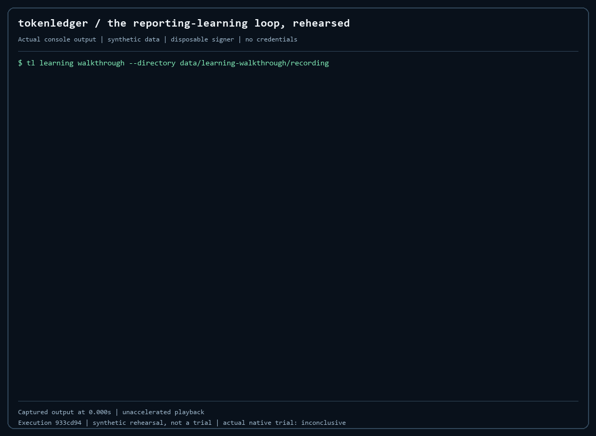

# The learning loop inside reporting

A reader asked the July NRR report for **July 1** and got no rows. The report is
dated **July 31**. Nothing was wrong with the number; the inspection was wrong.
This page shows how that finding becomes a governed change to reporting
behavior without editing a definition, a reported value or a control, and how
the whole loop is rehearsed, recorded and replayed here.

<!-- SUMMARY_START -->
| Step | Recorded walkthrough | Receipt or record |
|---|---|---|
| Report | July NRR, {{REPORT_ROWS}} lenses dated {{ASOF}} | `{{REPORT_RECEIPT}}` |
| Wrong-date inspection | requested {{WRONG_DATE}}: {{BASELINE_SELECTED}} rows selected, no explanation | baseline.json |
| Finding and verification | one confirmed finding; one refuted claim kept on the record | events.json |
| Candidate evaluation | {{CASES}} frozen cases; DuckDB candidate equals scalar oracle | `{{EVALUATION_RECEIPT}}` |
| Approval boundary | disposable synthetic signer; expanded, altered and misrouted approvals refused | plan.json, plan.json.sig |
| Next inspection | first inspection after authorization, requested {{NEXT_DATE}}: `{{FINDING_STATUS}}`, suggested `{{SUGGESTED}}` | `{{MEASUREMENT_RECEIPT}}` |
| Outcome | `{{OUTCOME}}` on a builder-chosen synthetic inspection | `{{OUTCOME_RECEIPT}}` |
| Refusals | {{REFUSALS}} refused attempts; the event stream unchanged after each | refusals.json |
| Preservation | original report reproduced; {{LEARNING_ROWS}} learning rows in the business stream | walkthrough.json |

Workflow events admitted: {{EVENTS}}. Observed workflow: **{{WORKFLOW_SECONDS}} seconds**; process **{{PROCESS_SECONDS}} seconds** including startup. [Exact values](assets/learning-recording/recording.json).
<!-- SUMMARY_END -->



The captured command is `tl learning walkthrough --directory data/learning-walkthrough/recording`.
It is recorded process output with its original arrival times; the GIF holds
the final result for eight seconds and omits nothing. For accessible text, use
the [complete transcript](assets/learning-recording/walkthrough.txt).

## What happens, in order

1. **A report exists.** The walkthrough generates an isolated synthetic
   business and reports July NRR through the ordinary views engine. The report
   has a receipt with its definition version, source identity, cutoffs and
   query hash.
2. **An inspection goes wrong.** Requesting the report at July 1 selects zero
   rows and offers no explanation. That is the baseline behavior.
3. **A finding is recorded.** A proposer submits the finding, bound to the
   report receipt and a hash of the inspected population. The proposer cannot
   verify its own finding; a tampered record never writes.
4. **Verification is independent.** A verifier re-reads the receipted
   population and confirms the finding. A second claim, that the report is
   empty at its own date, is refuted the same way and stays visible. A refuted
   finding cannot become a candidate.
5. **The candidate is bounded.** `nrr-date-diagnostic/v1` distinguishes a
   date-grain mismatch from a genuinely empty, incomplete, ambiguous or
   unavailable population and suggests the existing report date. It never
   substitutes a date, changes a reported value or clears a close hold.
6. **Evaluation is frozen.** Eleven builder-known cases run in DuckDB against
   an independent scalar oracle. This is regression evidence, not held-out
   accuracy. On a synthetic gateway the evaluation may only be recorded as
   DuckDB; a claim of native execution is refused.
7. **Approval is a signature over exact bytes.** The one-run plan pins the
   candidate, evaluation, execution hash, gateway identity, trust digest,
   expiry and fixed limits. A signed plan with expanded limits, a plan altered
   after signing and an approval sent by the wrong role are all refused.
8. **The first next inspection is used, once.** Two inspections arrive after
   authorization. Claiming the later, more favorable one is refused. The first
   is claimed, measured with the candidate, and its outcome is recorded.
9. **Authority is consumed.** A second trial, a retroactive revocation and an
   unregistered promotion activity are all refused.
10. **The original still reproduces.** The July report re-performs from its
    receipt, and the business stream contains no learning rows.

## What the labels mean

- **Synthetic rehearsal.** This walkthrough. Same gateway code, admission
  validator, candidate SQL, oracle and receipt engine as the native
  application, with an in-memory stream, DuckDB, and a signer generated for one
  run. Its gateway configuration is marked synthetic, cannot be served, and is
  refused by every cloud learning command.
- **`{{OUTCOME}}`** means the candidate produced an explanation for a wrong-date
  request that the builder chose. It is not a measured operating gain, an
  efficiency claim or a promotion. `--next-inspection-date 2026-07-31` records
  `inconclusive` instead, because the report is selected directly.
- **The disposable signer is not Chandler.** The admission contract fixes the
  principal label and pins the trust digest, so this key satisfies only the
  configuration that lists it. Its private half was deleted before packaging.
- **Recorded actual native trial.** One signed trial ran on BigQuery at the
  private engine revision `fabd91a` under the reviewer's enrolled key. The
  operator's first inspection requested the report date and selected all four
  rows, so the outcome is **inconclusive**. The one-run authority is consumed.
  No promotion or ongoing activation occurred. Its receipts are private and are
  not reproduced here; this page reports the result and does not improve it.
- **Fresh cloud execution** requires the cloud commands, a deployed gateway and
  a newly reviewed, newly signed plan. Nothing in this repository performs it.

## Replay the recorded walkthrough

After [installation](run.md), from the checkout:

```sh
tl learning replay-walkthrough data/learning-walkthrough/recorded --json
tl --db data/learning-walkthrough/recorded/world.duckdb --artifact-root data/learning-walkthrough/recorded receipt {{REPORT_RECEIPT}} --json
tl --artifact-root data/learning-walkthrough/recorded receipt {{EVALUATION_RECEIPT}} --json
```

The first command rebuilds workflow state from the retained fourteen-column
event stream, re-verifies the detached signature against the synthetic trust,
re-performs the candidate and the oracle, reproduces the original July report
and checks that the business stream holds no learning rows. Change any byte,
in the plan, the event stream, an oracle file or the ledger, and it fails.
Historical absolute paths inside the retained README describe the recording
machine's scratch clone; the relocated commands above are the replay path.

To create a fresh example with your own run IDs, run `tl learning walkthrough`.
Existing directories are never overwritten.

## Observed environment

The [capture record](assets/learning-recording/recording.json) binds public
execution commit `{{EXECUTION_SHA}}`, Python {{PYTHON}} and the pinned DuckDB
runtime. A fresh Windows virtual environment and editable installation took
**{{INSTALL_SECONDS}} seconds** with the existing pip cache. The workflow took
**{{WORKFLOW_SECONDS}} seconds**; the process **{{PROCESS_SECONDS}} seconds**. These are one
laptop's observations, not a benchmark. No model, billing or cloud credentials
were used, and no cloud job was submitted.

Next: [run the agent challenge](assess.md) or [inspect the cloud evidence](evidence.md).
