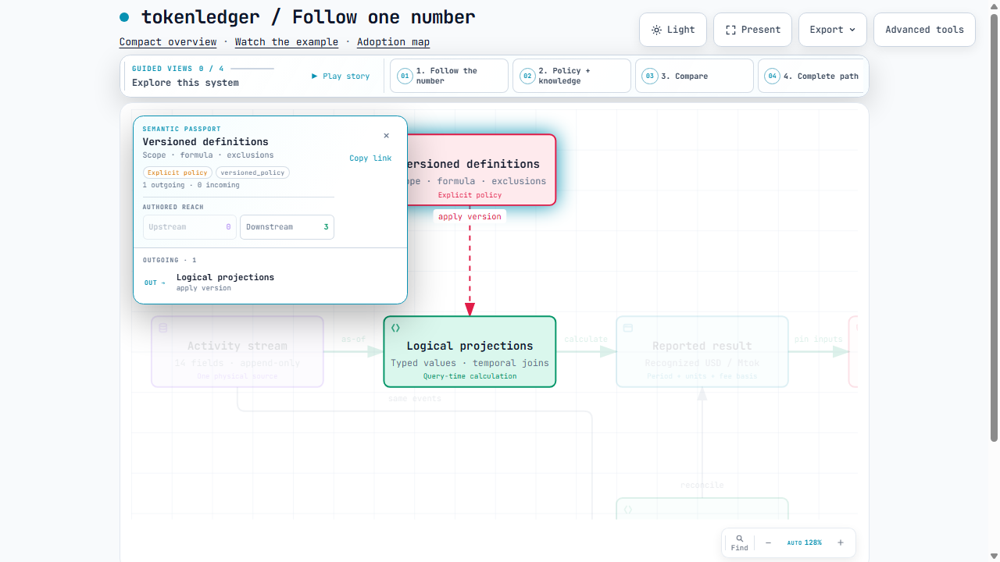
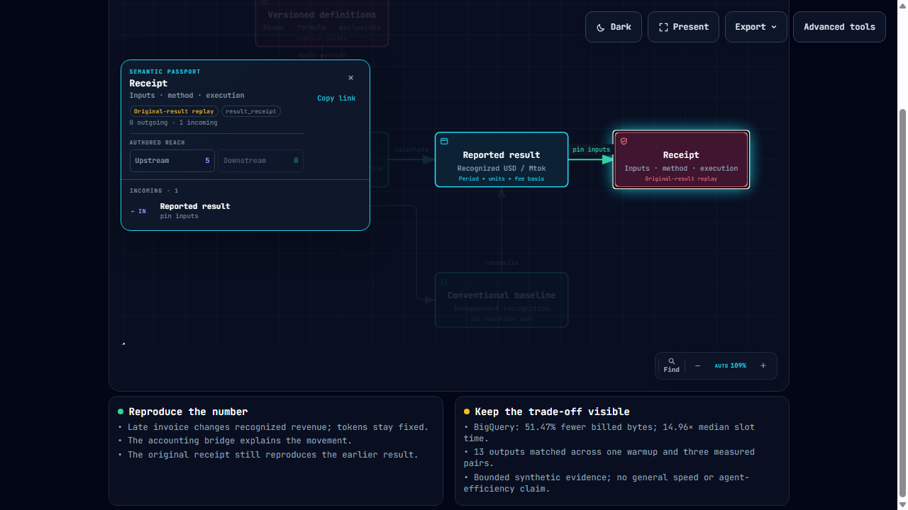

# Second agent review: findings and repairs

A second agent reported a first encounter with candidate `0fd1400`. It
constructed a four-task passing submission without consulting the visible
answer files, answer-producing task commands or implementation code during
construction. It reported successful replay, close recovery, negative controls
and all 72 tests. Its opening impression preceded reading the README. These are
agent usability observations, not human research or a held-out benchmark.

## Interface corrections

- Native yield and NRR replay return `recomputed: "spine_population"`. The
  vocabulary now documents that method marker, boolean bridge replay and
  saved-evidence verification separately. Receipt bytes and semantics are unchanged.
- `tl profile --json` already sends one result object to stdout and progress to
  stderr. The workflow now documents separate capture and JSON parsing. Builder
  verification reproduced the parser error when those streams were combined.
- The close command's top-level receipt identifies the challenge proof. The
  publication receipt comes from `close/publication.json`, also bound by
  `keys.close`. The workflow documents that distinction and how to inspect it.
- Windows installation now starts with a short destination and clone-local
  `core.longpaths=true`. A new short-path clone, isolated installation and demo
  passed using the unchanged executable at `0fd1400`.
- The corruption recipe changes a non-null invoice feature and asserts an actual
  difference. Updating the NULL `revenue_impact` by one was independently
  confirmed to be a no-op. The new probe is rejected before a scorecard exists.

[Contract verification](contract-check.json) records the checks. Its first
builder helper stopped because it guessed the progress field was `population`;
the emitted field is `output`. The corrected helper ran in a new attempt, with
the initial failure retained privately. This did not require a CLI change.

## Finder investigation

The reviewer reported Enter doing nothing, a canvas-wide ring and ineffective
direct node clicks. Those exact failures did not reproduce in headless Chrome
using trusted keyboard and pointer input. All six nodes selected correctly in
both themes; filtered Enter and result-button clicks also worked after chapter,
zoom and scroll changes. This does not invalidate the reviewer's observation
or establish that its in-app browser now passes.

The investigation did reproduce a related visibility defect: a selected node
could remain partly above the document viewport after searching from a scrolled
page. The reader now brings an offscreen single selection into view after the
native diagram camera settles. It preserves authored geometry and leaves a
visible selection or a multi-node chapter in place.

[Sixteen selection checks](finder-check.json) now require the selected node's
bounds to be inside the viewport. Default desktop layouts, chapter notes,
scrolled finder, Escape/focus return and player behavior were also rechecked;
the [current reader evidence](../../architecture/reader-check.json) binds the
new HTML. These are bounded builder browser checks. The original reported
failure remains subject to a focused recheck in the reviewer's browser.

## Preservation and scope

The full public suite passed: 72 tests, 79 existing deprecation warnings,
162.47 seconds. Presentation regeneration passed. The executable, grader,
definitions, baseline, retained source, recording and cloud evidence are
unchanged. The public expected answers remain visible; the review is not a
matched-agent efficiency measurement. No cloud jobs or real-source collection
were performed for this increment.

The measured cloud trade-off remains 51.47% fewer billed bytes with 14.96 times
median slot time. L1 remains inconclusive with no promotion. Publication and
general production admission remain separate decisions.
