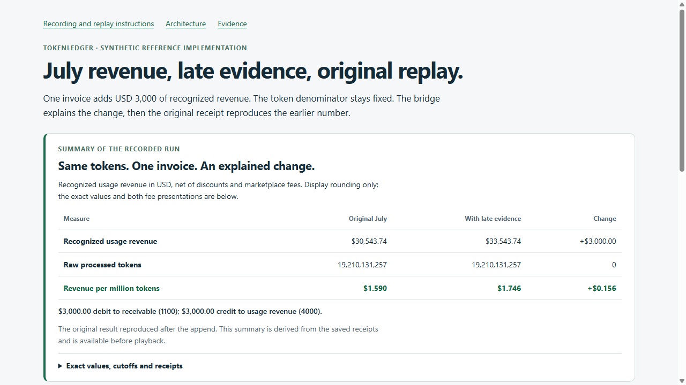
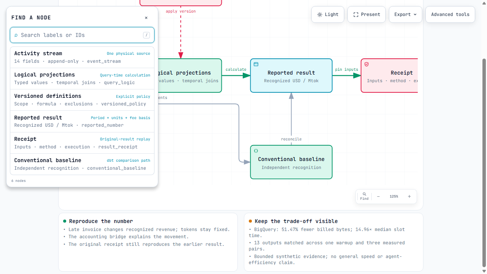

# First evaluator follow-up

The first evaluator reviewed candidate `65b717f` in a fresh agent session. It
installed and operated the example, reproduced its original result, selected
NRR v3, and exercised both the held close and meaningful rejections. It described
the project as a runnable reference implementation and identified ambiguity in
the opening, answer-route discoverability and visual presentation.

That was an agent evaluation, not human user research. It used the visible
reference facts to assemble its passing answer. Its arithmetic corroborated the
fixture; it did not independently implement recognition or rerun BigQuery.
The retained large-population checks remain separately scoped evidence.

## Changes

- The README states the category and operator. An adoption map assigns source,
  accounting-policy and publication responsibilities and describes a migration
  with reconciliation, escalation and rollback.
- The player and demo page show a summary derived from the recorded receipts.
  Revenue, tokens and yield use readable display precision; full values, fee
  bases, signed cents and receipt identities remain accessible. The original
  recording and timing are unchanged. Seeking back now labels the button correctly.
- A blank answer, field schema and workflow guide distinguish ordinary reporting
  and replay from verification of the visible reference answer. The grader and
  its tolerances are unchanged.
- The diagram opens with fewer controls, full chapter explanations and business
  metadata. Its finder remains within the viewport after scrolling at 125% zoom.
  Advanced tools remain available. The source transform is reproducible.

## Builder verification

The complete shipped suite passed: **72 tests**, with **79 existing deprecation
warnings**, in **137.58 seconds** on this run. The executable, definitions,
baseline, frozen challenge and recorded artifacts are unchanged from the
reviewed candidate. Presentation generation is checked in Linux/Windows CI.

[Seventeen workflow commands](workflow-check.json) passed. Fresh original and
current yield populations, and NRR v2/v3 populations, matched their retained
rows. Six business receipts replayed. The source hold returned exit 2; recovery
returned exit 0 and kept publication bytes identical. The blank, wrong-cent
and missing-task submissions failed; the visible reference passed. This is
builder verification of recipes, not a new first-time evaluator observation.

The recorded yield and account-bridge receipts re-performed separately, binding
the new summary to the original source. The presentation builder verifies their
seals and enforces exact equality between the player's events and original cast
and transcript. Its `--check` detects stale generated presentation.

[Browser measurements](../../architecture/reader-check.json) bind the final
HTML. The default diagram fits 1440×900, 1600×1000, 1920×1080 and 2048×1320.
Smaller windows scroll vertically. The 1280×720 scrolled finder at 125% zoom
retains its heading and close control; Escape returns focus. Chapter text is
available in full, and advanced controls remain reachable. Player seeking and
exact final transcript checks passed. These are bounded Chrome checks, not an
exhaustive accessibility audit. Export formats were not rerun.

The first builder recipe run completed its checks but its summary writer failed
to serialize a Path. The summary helper was corrected and the complete recipe
was repeated in a new isolated attempt. Initial diagram checks exposed additional
desktop overflow; spacing was corrected and the final artifact rechecked. These
intermediate runs are not presented as successful release evidence.

## Next review

A returning evaluator can recheck its reported defects. A fresh evaluator can
supply a new opening impression and attempt the workflow without coaching.
Neither outcome is presumed. Ask what they understood and where they struggled;
record solution exposure and unsuccessful tasks. Publication remains pending
Chandler's approval of the exact release.

The comparison still states **51.47% fewer billed bytes** with **14.96 times
median slot time**, including the slower first pair and the failed tenfold
hypothesis. Comparative agent efficiency is unmeasured. L1 remains completed
inconclusive with no promotion.
